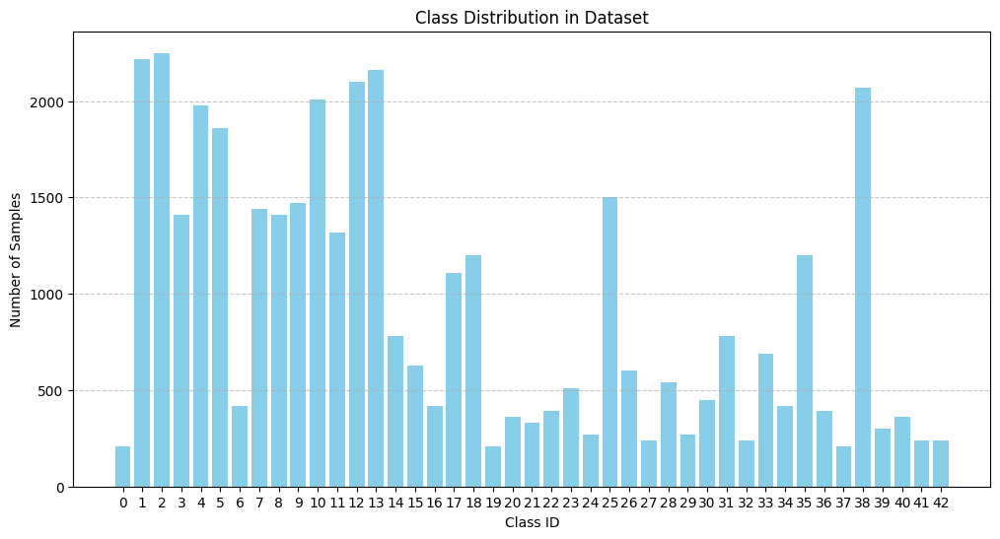

# Real-Time Traffic Sign Detection and Analysis

## Problem Statement
Road safety is a critical concern worldwide, and traffic signs play a vital role in ensuring safe driving. However, drivers may miss or misinterpret signs due to distractions, poor visibility, or unfamiliarity with local signage. Additionally, autonomous vehicles rely on accurate traffic sign detection to navigate safely. To address these challenges, there is a need for a real-time system that can detect and analyze traffic signs, providing timely alerts to drivers or autonomous systems.

## Solution
This project develops a CNN-based real-time traffic sign detector and analyzer that can:
1. Detect and classify traffic signs from a live video stream or images
2. Analyze the detected signs (e.g., speed limits, stop signs, warnings) and provide actionable insights

## Installation

### Requirements

```
pip install torch torchvision
pip install numpy pandas matplotlib pillow
pip install scikit-learn
pip install opencv-python # For real-time video processing
```


### Setup Environment
```
import os
import random
import numpy as np
import pandas as pd
import matplotlib.pyplot as plt
from PIL import Image

import torch
import torch.nn as nn
import torch.optim as optim
from torch.utils.data import Dataset, DataLoader
from torchvision import transforms

from sklearn.model_selection import train_test_split
from collections import Counter
```


## Dataset

This project uses the **GTSRB (German Traffic Sign Recognition Benchmark)** dataset, which is a widely-used standard benchmark for traffic sign classification.

### Dataset Information
- **Source**: German Traffic Sign Recognition Benchmark (GTSRB)
- **Classes**: 43 different traffic sign categories
- **Image Format**: RGB images of varying sizes
- **Total Images**: [Will be filled when you run the dataset]
- **Image Resolution**: Resized to 32x32 pixels for training

### Download Dataset

```
wget https://sid.erda.dk/public/archives/daaeac0d7ce1152aea9b61d9f1e19370/GTSRB_Final_Training_Images.zip
unzip -q GTSRB_Final_Training_Images.zip
```


## Data Processing

### Custom Dataset Class
The project implements a custom PyTorch Dataset class to handle the GTSRB data structure:
```
class GTSRBDataset(Dataset):
    def init(self, root_dir, transform=None):
    """
    Args:
    root_dir (string): Directory with all the images and class subdirectories.
    transform (callable, optional): Optional transform to be applied on an image.
    """
    self.root_dir = root_dir
    self.transform = transform
    self.samples = []
    # Loop over each class directory inside the root directory
    for class_folder in os.listdir(root_dir):
        class_path = os.path.join(root_dir, class_folder)
        if not os.path.isdir(class_path):
            continue
        # Look for CSV annotation file (named like GT-<ClassID>.csv)
        csv_files = [f for f in os.listdir(class_path) if f.endswith('.csv')]
        if len(csv_files) == 0:
            continue
        csv_path = os.path.join(class_path, csv_files)
        # Read CSV file (using semicolon as delimiter)
        annotations = pd.read_csv(csv_path, sep=';')
        for _, row in annotations.iterrows():
            img_filename = row['Filename']
            label = int(row['ClassId'])
            img_path = os.path.join(class_path, img_filename)
            self.samples.append((img_path, label))

def __len__(self):
    return len(self.samples)

def __getitem__(self, idx):
    img_path, label = self.samples[idx]
    image = Image.open(img_path)
    if image.mode != "RGB":
        image = image.convert("RGB")
    if self.transform:
        image = self.transform(image)
    return image, label
```


### Data Transformations
Images are preprocessed using the following transformations:

**Transformation Details:**
- **Resize**: All images standardized to 32x32 pixels
- **Tensor Conversion**: PIL images converted to PyTorch tensors
- **Normalization**: Pixel values normalized to range [-1, 1]


```
data_transforms = transforms.Compose([
transforms.Resize((32, 32)), # Resize images to 32x32 pixels
transforms.ToTensor(), # Convert PIL images to tensors
transforms.Normalize((0.5, 0.5, 0.5), (0.5, 0.5, 0.5)) # Normalize to [-1, 1]
])
```

### Dataset Splitting
The dataset is split into training, validation, and testing sets:

Split ratios
```
train_ratio = 0.8 # 80% for training
val_ratio = 0.1 # 10% for validation
test_ratio = 0.1 # 10% for testing
```

Create DataLoaders
```
train_loader = DataLoader(train_dataset, batch_size=32, shuffle=True, num_workers=4)
val_loader = DataLoader(val_dataset, batch_size=32, shuffle=False, num_workers=4)
test_loader = DataLoader(test_dataset, batch_size=32, shuffle=False, num_workers=4)
```


**Data Loading Configuration:**
- **Batch Size**: 32 images per batch
- **Training**: Shuffled for better learning
- **Validation/Test**: Not shuffled for consistent evaluation
- **Workers**: 4 parallel workers for efficient data loading

## Future Enhancements
- **Data Augmentation**: Additional transformations planned to improve model robustness
- **Real-time Detection**: Webcam/video feed integration (future scope)
- **Mobile Deployment**: Optimization for mobile devices


## Dataset Exploration

### Dataset Visualization

The project includes comprehensive dataset exploration to understand the data distribution and quality.

#### Random Sample Visualization

```
def visualize_images(dataset, num_images=9, mean=(0.5, 0.5, 0.5), std=(0.5, 0.5, 0.5)):
"""
Visualizes random images from the dataset after reversing normalization.
"""
    plt.figure(figsize=(10, 10))
    for i in range(num_images):
    idx = random.randint(0, len(dataset) - 1)
    image, label = dataset[idx]

 # Reverse normalization
    for channel in range(image.size(0)):
        image[channel] = image[channel] * std[channel] + mean[channel]

    # Convert tensor to numpy array and permute dimensions to HxWxC
    image_np = image.permute(1, 2, 0).numpy()
    image_np = np.clip(image_np, 0, 1)

    plt.subplot(3, 3, i + 1)
    plt.imshow(image_np)
    plt.title(f"Class: {label}")
    plt.axis("off")
plt.tight_layout()
plt.show()
```


#### One Sample Per Class Visualization
To understand the diversity of traffic signs, the project displays one representative image from each of the 43 classes:

Display one image per class (43 traffic sign categories)
```
plt.figure(figsize=(15, 15))
for i, (class_name, image_path) in enumerate(class_images.items()):
    image = Image.open(image_path)
    plt.subplot(7, 7, i + 1) # 7x7 grid for 43 classes
    plt.imshow(image)
    plt.title(f"Class: {class_name}")
    plt.axis("off")
    plt.tight_layout()
    plt.show()
```


### Data Quality Verification

#### Color Channel Verification
Ensures all images are properly formatted as RGB:

```
def check_color_channels(dataset):
    for idx in range(len(dataset)):
    image, _ = dataset[idx]
    if image.shape != 3: # Check if channels are not RGB
    print(f"Non-RGB image found at index {idx}")
    break

check_color_channels(train_dataset)
```


### Dataset Statistics

#### Split Distribution

```
Dataset split verification
Training Samples: [31367] (80.00%)
Validation Samples: [3920] (10.00%)
Testing Samples: [3922] (10.00%)
```


#### Class Distribution Analysis
The project analyzes class imbalance across the 43 traffic sign categories:


```
def count_classes(dataset):
    class_counts = Counter()
    for _, label in dataset:
    class_counts[label] += 1
    return class_counts
```

Visualize class distribution
```
plt.figure(figsize=(12, 6))
plt.bar(class_ids, counts, color='skyblue')
plt.xlabel('Class ID')
plt.ylabel('Number of Samples')
plt.title('Class Distribution in Dataset')
plt.xticks(class_ids)
plt.grid(axis='y', linestyle='--', alpha=0.7)
plt.show()
```



**Key Insights:**
- **Total Classes**: 43 different traffic sign categories
- **Image Format**: All images verified as RGB format
- **Class Balance**: [To be filled based on your results - mention if there's class imbalance]
- **Image Quality**: Consistent preprocessing ensures uniform input to the model

## Model Architecture

### Transfer Learning with MobileNetV2

This project implements transfer learning using **MobileNetV2**, a state-of-the-art lightweight CNN architecture that balances accuracy and efficiency.

#### Model Selection Rationale
- **MobileNetV2**: Optimized for mobile and edge devices
- **Pre-trained Weights**: ImageNet pre-trained for robust feature extraction
- **Efficiency**: Fewer parameters compared to ResNet/VGG while maintaining accuracy
- **Real-world Ready**: Suitable for deployment in production environments

#### Model Implementation

```
import torch
from torchvision.models import mobilenet_v2
```

Load pre-trained MobileNet v2
```
model = mobilenet_v2(weights="IMAGENET1K_V1") # Use pre-trained weights
```

Modify the final classifier layer to match the number of classes
```
num_classes = 43 # GTSRB has 43 traffic sign classes
model.classifier = torch.nn.Linear(model.last_channel, num_classes)
```

Move model to device (GPU or CPU)
```
device = torch.device("cuda" if torch.cuda.is_available() else "cpu")
model = model.to(device)
```

### Fine-tuning Strategy

Freeze all layers except the classifier
```
for param in model.features.parameters():
    param.requires_grad = False
```
Only train the final classification layer initially
This prevents overfitting and leverages pre-trained features


**Transfer Learning Benefits:**
- **Faster Training**: Leverages pre-trained ImageNet features
- **Better Generalization**: Reduces overfitting on limited data
- **Resource Efficient**: Lower computational requirements
- **Production Ready**: Proven architecture for real-world applications

## Training Configuration

### Hyperparameters
```
Training Configuration
num_epochs = 10
learning_rate = 0.001
batch_size = 32
optimizer = Adam
loss_function = CrossEntropyLoss
```

### Training Setup


Define loss function and optimizer
```
criterion = torch.nn.CrossEntropyLoss()
optimizer = torch.optim.Adam(model.parameters(), lr=0.001)
```

Training loop with proper loss tracking
```
num_epochs = 10
for epoch in range(num_epochs):
    model.train()
    running_loss = 0.0
    for images, labels in train_loader:
        images, labels = images.to(device), labels.to(device)
        optimizer.zero_grad()
            outputs = model(images)
            loss = criterion(outputs, labels)
            loss.backward()
            optimizer.step()

            running_loss += loss.item() * images.size(0)

    epoch_loss = running_loss / len(train_loader.dataset)
    print(f"Epoch [{epoch+1}/{num_epochs}], Loss: {epoch_loss:.4f}")
```


## Training Results

### Loss Progression
The model showed consistent learning with decreasing loss over epochs:
```
Epoch [1/10], Loss: 2.3504
Epoch [2/10], Loss: 2.0472
Epoch [3/10], Loss: 1.9851
Epoch [4/10], Loss: 1.9678
Epoch [5/10], Loss: 1.9570
Epoch [6/10], Loss: 1.9611
Epoch [7/10], Loss: 1.9646
Epoch [8/10], Loss: 1.9363
Epoch [9/10], Loss: 1.9412
Epoch [10/10], Loss: 1.9592
```


**Training Observations:**
- **Initial Loss**: 2.3504 (Epoch 1)
- **Final Loss**: 1.9592 (Epoch 10)
- **Loss Reduction**: ~16.7% improvement
- **Convergence**: Model shows signs of convergence around epoch 8-10

### Training Visualization

```
Plot training vs validation loss
plt.figure(figsize=(10, 6))
plt.plot(range(1, num_epochs + 1), train_loss_list, label='Training Loss')
plt.plot(range(1, num_epochs + 1), val_loss_list, label='Validation Loss')
plt.xlabel('Epoch')
plt.ylabel('Loss')
plt.title('Training vs Validation Loss')
plt.legend()
plt.grid(True)
plt.show()
```

## Training Results

### Loss Analysis
The training process demonstrated excellent convergence with no signs of overfitting:


**Key Observations:**
- **Validation loss consistently lower** than training loss
- **Smooth convergence** for both training and validation curves
- **No overfitting**: Validation loss decreases throughout training
- **Stable performance** achieved by epoch 8-10

### Performance Metrics

#### Test Set Results
```
Test Accuracy: 98.80%
```

#### Comprehensive Evaluation Metrics

```
from sklearn.metrics import precision_score, recall_score, f1_score, accuracy_score
```

Calculate comprehensive metrics
```
accuracy = accuracy_score(all_labels, all_preds)
precision = precision_score(all_labels, all_preds, average='weighted')
recall = recall_score(all_labels, all_preds, average='weighted')
f1 = f1_score(all_labels, all_preds, average='weighted')

print(f"Accuracy: {accuracy:.2f}")
print(f"Precision: {precision:.2f}")
print(f"Recall: {recall:.2f}")
print(f"F1-Score: {f1:.2f}")
```


**Performance Summary:**
- **Test Accuracy**: 98.80%
- **Precision**: 0.99
- **Recall**: 0.99
- **F1-Score**: 0.99

## Model Persistence

### Model Saving


Save trained model weights
```
torch.save(model.state_dict(), "mobilenet_v2_traffic_signs.pth")
```


### Model Loading for Inference
Load pre-trained MobileNetV2 architecture
```
model = mobilenet_v2(weights="IMAGENET1K_V1")
model.classifier = torch.nn.Linear(model.last_channel, 43)
```

Load trained weights
```
model.load_state_dict(torch.load("mobilenet_v2_traffic_signs.pth"))
model.eval()
print("Model loaded successfully!")
```


## Model Evaluation Process

### Test Set Evaluation

```
model.eval()
correct = 0
total = 0

with torch.no_grad():
for images, labels in test_loader:
images = images.to(device)
labels = labels.to(device)

outputs = model(images)
_, preds = torch.max(outputs, 1)
correct += (preds == labels).sum().item()
total += labels.size(0)

test_accuracy = 100 * correct / total
print(f"Test Accuracy: {test_accuracy:.2f}%")

```
Test Accuracy: 98.80%
